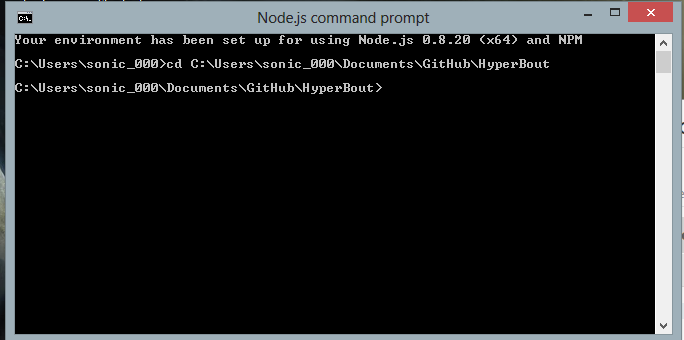
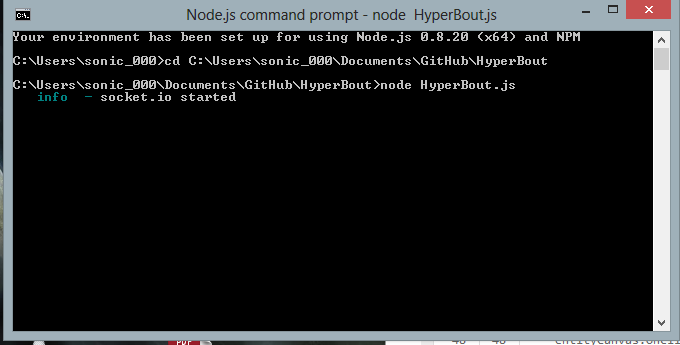
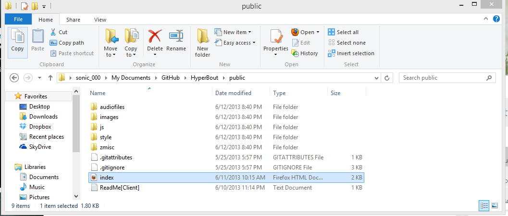
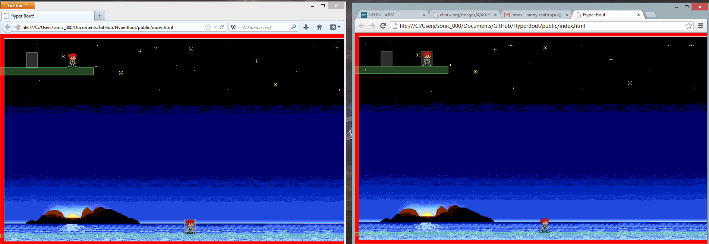

# Hyper Bout

## Prerequisites
You need to already have installed nodejs on your machine. http://nodejs.org/download/

## How to Run
* Open up Node.js Command Prompt and change to directory of game

* Start the HyperBout server by typing in “node ServerBout.js”

* Go into the public folder and open up the index.html file in both firefox and chrome

* Players can see both each other’s movements (however only box2d draw on the local player, not remote players)

## Server Side Folders Instruction
### Folders and Files
List of Folders: 
* /  (root)
  * Contains all files needed to run on the server
* Examples: 
  * Contains example projects that the team looks at for ideas. (Currently has basic Node game you can run with Code Source for explanation)
* node_modules: 
  * Contains socket.io library [No need to touch]
* public: 
  * Contains files that will be run on the user's machine
* archive:
  * contains files of older versions that are no longer in use

JS Files:
* ServerBout.js: 
  * Starting node application js file
* ServerPlayer.js: 
  * Player class of whose data will be sent from client to/from host