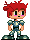

# Hyper Bout

## Client Side Folders Instructions
List of Folders:
* /public
  * Contains all file needed to run on the client end
* audiofiles: 
  * Folder containing audio files to be used
* images: 
  * Folder containing image sources
* js: 
  * Contains javascript files
* style: 
  * Contains .css files
* zmisc: 
  * Contains files currently not in use
* index: 
  * HTML Page to open 
* tests: 
  * Contains unit tests and all the library files associated with it.